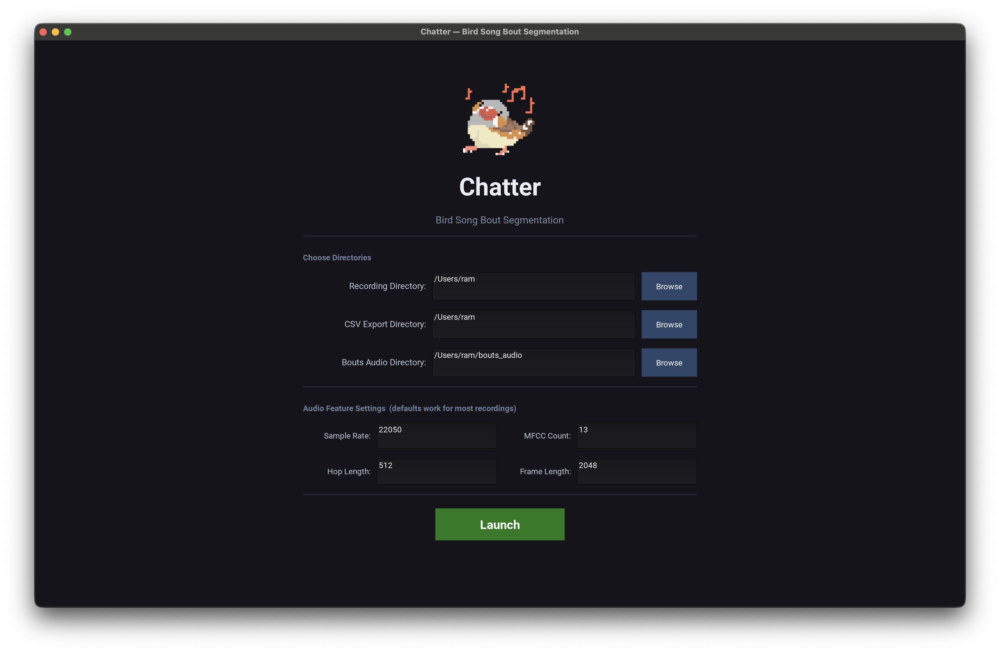
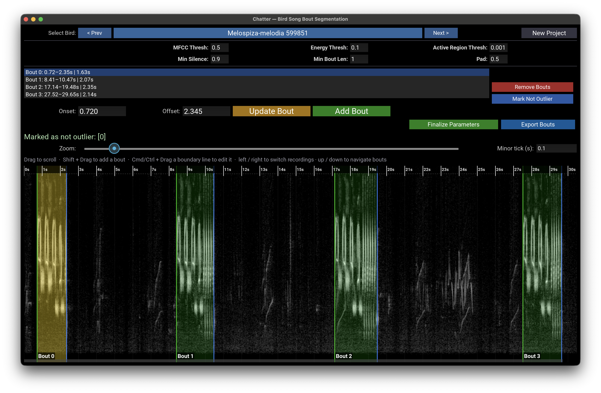

# Chatter

Semi-automatic bout segmentation from bird song recordings using acoustic features such as Spectral Flux, Energy, and MFCC coefficients. An optional machine learning stage helps ensure only bird songs are kept — using MFCC-based speech detection to flag and filter out human voices and other non-song outliers.

Chatter is a desktop application (built with Kivy). The recommended way to use it
is to download a pre-packaged build.

<p align="center">
  
  
</p>


> The original Jupyter notebook workflow (`Chatter.ipynb`) has been **retired**
> and superseded by the desktop app described below. If you still want the
> notebook version, it remains available as the
> [**v0.3.0 release**](https://github.com/mrtnzram/Chatter/releases/tag/v0.3.0).

## Download (recommended)

Grab the latest build for your platform from the
[**Releases page**](https://github.com/mrtnzram/Chatter/releases):

| Platform | File | What to do |
| --- | --- | --- |
| Windows | `Chatter.exe` | Download and double-click to run. |
| macOS (Apple Silicon) | `Chatter-AppleSilicon.dmg` | Open it and drag **Chatter** into Applications (see note below). |
| macOS (Intel) | `Chatter-Intel.dmg` | Open it and drag **Chatter** into Applications (see note below). |

**Which Mac do I have?** Click the  menu → **About This Mac**. A "Chip" line
reading *Apple M1/M2/M3/M4* means Apple Silicon; a "Processor" line reading
*Intel* means Intel. The two builds are not interchangeable — an Apple Silicon
build will not open on an Intel Mac.

### Windows

Double-click `Chatter.exe`. Because the app is **not code-signed**, Windows
SmartScreen may show a blue "Windows protected your PC" warning on first launch —
click **More info → Run anyway**. The first launch is a little slow (the
single-file exe unpacks itself to a temporary folder each time it starts).

### macOS

Download the `.dmg` that matches your Mac's chip (see the table above),
double-click it to open, then drag **Chatter** onto the
**Applications** shortcut shown in the window. Open Chatter from your Applications
folder. The app is **unsigned / not notarized**, so the first launch needs one
extra step to get past Gatekeeper:

1. **Right-click (or Control-click) `Chatter` → Open**, then click **Open** in
   the dialog that appears.
2. If macOS still blocks it, go to **System Settings → Privacy & Security**, scroll
   to the Security section, and click **Open Anyway** next to the Chatter message,
   then launch the app again.

You only need to do this once; afterward it opens normally.

## Run from source (developers)

Contributors can run the app directly from the repository:

1. Clone the repo: `git clone https://github.com/mrtnzram/Chatter.git`
2. Move into it: `cd Chatter`
3. Install the Kivy app dependencies: `pip install -r chatter_app/requirements_kivy.txt`
   - To include optional BirdNET support, also `pip install birdnetlib tensorflow`.
4. Launch the app:
   ```bash
   cd chatter_app
   python main.py
   ```

## The Process 

Chatter mainly uses librosa's audio extracting features paired with computational techniques and an optional machine learning stage (using your own model or [BirdNet](https://birdnet.cornell.edu/) to detect bouts. This process for detecting bouts in audio signals begins with detecting active regions using spectral flux. Spectral flux is the measure of rate of change in the power spectrum between successive frames. Peaks in spectral flux often correspond to potential active regions. Next, MFCC coefficients pattern recognition is applied to refine these regions further. Mel-Frequency Cepstral Coefficients (MFCCs), which represent the short-term power spectrum of the audio, are extracted and analyzed. When a pattern of atleast three frames is repeated twice, Chatter detects this as a potential active region aswell These identified active regions are then refined by combining RMS energy and MFCC coefficients. This step involves applying thresholds to discard regions with low RMS energy or inconsistent MFCC patterns that may be the product of noise. The result of this stage is a set of potential bouts, which are segments likely to contain the target signals. An optional machine learning model classifier can be used to further validate and classify the detected bouts. Following this, using the interactive widgets, users are able to refine the onset and offsets of these detected bouts, aswell as remove errors and add undetected bouts.


---
# Using the App

> This is a quick-start summary. A full step-by-step **manual** (with screenshots)
> will be added separately as `docs/manual.md`.

## How to Use

1. **Pick your folders (Welcome screen).** On launch, choose three directories:
   - **Recording directory** — the folder of `.wav` files to analyze. Filenames
     should follow `Genus-species-birdid.wav` so Chatter can read each bird's
     metadata.
   - **CSV export directory** — where `<recname>.csv` and `<recname>.duckdb` are
     written (both named after your recording directory).
   - **Bouts audio directory** — where exported audio clips are saved.

   The CSV and audio directories are auto-filled from the recording folder; you can
   override them. Click **Launch** to scan the dataset and open the main screen.

2. **Select a bird/recording.** Use the dropdown (or the prev/next arrows) at the
   top to choose which recording to display and edit.

3. **Adjust detection parameters (optional).** Edit the parameter fields (MFCC
   threshold, energy threshold, active-region threshold, min silence, min bout
   length, pad). The spectrogram and detected bouts recompute automatically. The
   defaults work well for most recordings — see
   [Chatter Parameters](#chatter-parameters) for what each one does.

4. **Tune the frequency band (optional).** The vertical **band-pass filter
   slider** to the left of the spectrogram restricts detection to a frequency
   range. Drag its **lower handle** to set the high-pass cutoff (removes energy
   *below* it, default 500 Hz) and its **upper handle** to set the low-pass
   cutoff (removes energy *above* it, off by default = full bandwidth). The
   shaded band between the handles is what is kept. Bouts re-detect when you
   release a handle. The filter affects **detection and the spectrogram display
   only** — exported clips are always a faithful, unfiltered crop of the
   original recording.

5. **Adjust the view (optional, display-only).** Below the parameters, the
   **Zoom**, **Brightness**, and **Contrast** sliders change how the spectrogram
   looks without altering the audio or the detected bouts. Use **Brightness**
   and **Contrast** to make faint songs easier to see; double-click a tick to
   reset to default.

6. **Edit bouts directly on the spectrogram.**
   - **Drag** the spectrogram to scroll through time.
   - **Shift + Drag** to add a new bout over a region.
   - **Cmd/Ctrl + Drag** an onset/offset line to move that boundary.

   Or use the buttons: select bouts in the list and click **Update Bout**,
   **Add Bout**, or **Remove Bouts**. If a good bout is wrongly flagged as an
   outlier, select it and click **Mark Not Outlier**.

7. **Finalize & export.**
   - **Finalize Parameters** saves the current parameter settings for the selected
     bird (only needed if you changed parameters from the defaults).
   - **Export Bouts** writes each bout as an audio clip to the bouts audio directory
     and saves bout metadata to `<recname>.duckdb` + `<recname>.csv`. Reopening the
     same project reloads this, so you can return to your progress
     anytime. The **Pad** parameter controls how much extra audio (in seconds) is
     kept before each bout's onset and after its offset in the exported clips — so
     the clips include a little lead-in/lead-out rather than cutting off exactly at
     the detected boundaries. Exported clips are cut from the **original
     recording** — the band-pass filter and display adjustments are not baked in.

8. **Start over.** **New Project** (top-right) returns to the Welcome screen to pick
   a different dataset. Un-exported edits are lost, so export first.

> **Tip:** 30-second to 1-minute recordings work best. Longer files make
> recompute and bird-switching slower. To mitigate process time in longer files, they are chunked into 2 minute recordings shown as recording_n in the dropdown. 
---

## Audio Feature Settings

These control how audio is loaded and how the underlying features are computed.
They are set once on the **Welcome screen** (under *Audio Feature Settings*) before
you launch a project, and apply to the whole session. The defaults work for most
recordings.

- **Sample Rate** (`sr`)  

  *default: 22050*  

  The target sampling rate for audio loading.  
  All audio files will be resampled to this rate.

- **MFCC Count** (`n_mfcc`)  

  *default: 13*  

  Number of Mel-frequency cepstral coefficients (MFCCs) to compute for each frame.

- **Hop Length** (`hop_length`)  

  *default: 512*  

  Number of samples between successive frames for all frame-based calculations.  
  Controls the time resolution of features.

- **Frame Length** (`frame_length`)  

  *default: 2048*  

  Number of samples per analysis frame for energy and spectral calculations.

## Chatter Parameters

These are the per-recording detection parameters you adjust on the **main screen**.
The spectrogram and detected bouts recompute automatically as you change them.

- **MFCC Thresh** (`mfcc_threshold`)  

  *default: 0.5*  

  The minimum variance required in the MFCCs for a frame to be considered active.  
  Used in refining active regions.

- **Energy Thresh** (`energy_threshold`)  

  *default: 0.1*  

  The minimum RMS energy required for a frame to be considered active,  
  expressed as a fraction of the maximum RMS energy.

- **Active Region Thresh** (`active_region_thresh`)  

  *default: 0.001*  

  The minimum spectral flux (as a fraction of the maximum) required for a frame to be considered active.

- **Min Silence** (`min_silence`)  

  *default: 0.9*  

  Minimum duration of silence (in seconds) required to separate two bouts.  
  Shorter silences will be merged into a single bout.

- **Min Bout Len** (`min_bout_len`)  

  *default: 1.0*  

  Minimum duration (in seconds) for a detected bout to be kept.

- **Pad** (`pad`)  

  *default: 0.5*  

  Amount of time (in seconds) to pad around detected bouts — before the onset and after the offset — when exporting each bout as a wav file.

- **Band-pass filter** (`highpass_cutoff` / `lowpass_cutoff`)  

  *defaults: high-pass 500 Hz, low-pass off (full bandwidth)*  

  The vertical two-handle slider to the left of the spectrogram. The lower
  handle is the **high-pass cutoff** (removes energy below it); the upper handle
  is the **low-pass cutoff** (removes energy above it). The track runs linearly
  from 0 Hz at the bottom to the Nyquist frequency (`sr / 2`) at the top, so it
  lines up with the spectrogram's frequency axis. Bouts re-detect when a handle
  is released. This filter is applied to the signal used for **detection and the
  spectrogram only** — exported audio clips are an unfiltered crop of the
  original recording.

## Display Settings (view only)

These sliders on the main screen change how the spectrogram is rendered. They do
**not** affect the audio, the detected bouts, or anything that gets exported.

- **Zoom**  

  *default: 1.0 (range 0.5–3.0)*  

  Horizontal (time-axis) magnification of the spectrogram.

- **Brightness**  

  *default: 0.0 (range -0.5–0.5)*  

  Shifts the spectrogram lighter or darker. Useful for making faint songs more
  visible.

- **Contrast**  

  *default: 1.0 (range 0.5–3.0)*  

  Stretches or compresses the spectrogram's dynamic range about mid-grey to
  sharpen or soften the difference between song and background.

# How Chatter Stores Data

Chatter keeps your work in three places. Two live **on disk** in the CSV export
directory you chose on the Welcome screen and survive restarts; one is purely
**in memory** and exists only while the app is open. All three are named after
your **recording directory** (referred to below as `<recname>`), so every dataset
keeps its own separate files and projects never bleed into each other.

## Persistent storage (on disk, survives restarts)

### `<recname>.duckdb`

A [DuckDB](https://duckdb.org/) database file written to the CSV export
directory. It holds the **`bouts` table**: one row per exported bout, with the
columns listed below. This is the authoritative record of your exported work.

When you reopen a project pointed at the same recording directory, Chatter reads
this file and pre-populates everything you exported before — already-exported
birds are marked in the dropdown, so you can pick up exactly where you left off.
Each `Export Bouts` action *replaces* the stored bouts for that recording, so
removing or editing a bout and re-exporting keeps the database in sync rather
than piling up stale rows.

### `<recname>.csv`

A flat CSV written alongside the DuckDB file and **regenerated from the database
every time you export**. It contains the exact same bout rows as the `bouts`
table, in a format that's easy to open in Excel, R, or pandas for downstream
analysis.

The CSV is also a migration path: if you start a project and the DuckDB file is
empty (or missing) but a `<recname>.csv` already exists, Chatter imports the CSV
into the database once on launch — so older CSV-only projects lose nothing.

**Columns in `<recname>.duckdb` / `<recname>.csv`** (one row per bout):

| Column | Description |
| --- | --- |
| `species` | Bird species name or code. |
| `bird_id` | Identifier for the bird. |
| `wav_location` | Path to the original recording. |
| `song_id` | Identifier for the recording/song. |
| `bout_id` | Index of the bout within the recording. |
| `duration` | Bout length in seconds (`offset − onset`). |
| `onset` | Bout start time (seconds, unpadded). |
| `offset` | Bout end time (seconds, unpadded). |
| `wavstart` | Start of the exported clip (with **Pad**, seconds). |
| `wavend` | End of the exported clip (with **Pad**, seconds). |
| `intersong_interval` | Gap since the previous bout ended (seconds; empty for the first bout). |
| `bout_wav` | Path to the exported audio clip for this bout. |

The exported audio clips themselves are written to the **Bouts audio directory**
as individual `.wav` files (named `species_birdid_bout<n>.wav`) and cut from the
**original, unfiltered recording**.

## Temporary storage (in memory, cleared on exit)

### Spectrogram cache

To keep scrolling and switching between birds fast, Chatter caches computed
spectrograms in an **in-memory** DuckDB database (never written to disk). It is
created empty on every launch, bounded to a handful of recent spectrograms
(least-recently-used entries are evicted), and freed completely when you close
the app or start a New Project.

The cache key includes the recording, the audio feature settings, and the
band-pass filter cutoffs — so changing a frequency cutoff produces a fresh
spectrogram instead of a stale cached one. Brightness and Contrast are applied
on top of the cached image at display time, so adjusting them is instant and
never invalidates the cache.

### `df` — the in-session working table

While the app is running, all recordings live in a single in-memory pandas
DataFrame (`df`), one row per recording, holding the loaded `audio`, sample rate
`sr`, the working list of `bouts`, and the computed feature arrays (`mfcc`,
`spectral_flux`, `rms_energy`, `active_regions`, `refined_regions`). This is
where your live edits accumulate; nothing here is permanent until you
**Export Bouts**, which is what writes it out to the DuckDB + CSV files above.

> **Heads up:** Un-exported edits are only held in memory. Switching projects or
> closing the app discards them — export before you leave.

## Notes

- The spectrogram and overlays update automatically with parameter changes.
- All edits are reflected in the current session and can be exported at any time.
